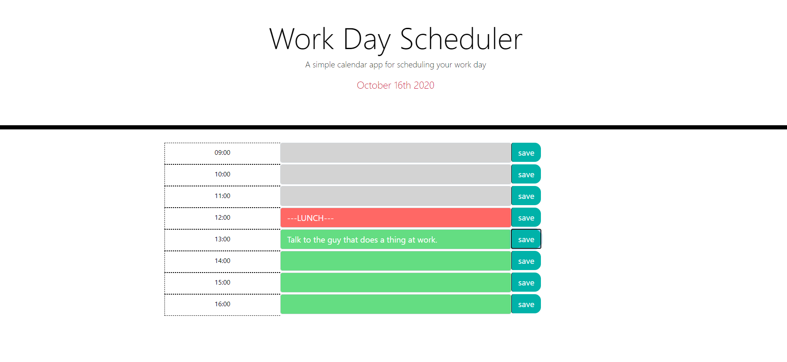

## homework-5
This project is a day planner that allows the user to enter events into each time slot for the work day. The events are stored locally, so that they can be revisited or edited throughout the day.

## Motivation
This project was completed to reinforce skills using html, CSS, JavaScript, JQuery, and the Moment.JS library.

## Build status
Passing

## Code style

 
## Screenshots
</img>

## Tech/framework used
HTML
CSS
JavaScript
JQuery
Moment.js

## Features
Planner is color coded for easy reference to future and past events.

## Code Example

## Installation
N/A

## API Reference
N/A

## Tests
N/A

## How to use?
Find the desired hour and enter the event. Events can be submitted by clicking "save" or with the "enter" key.

## Contribute
N/A

## Credits
N/A

## License
N/A
